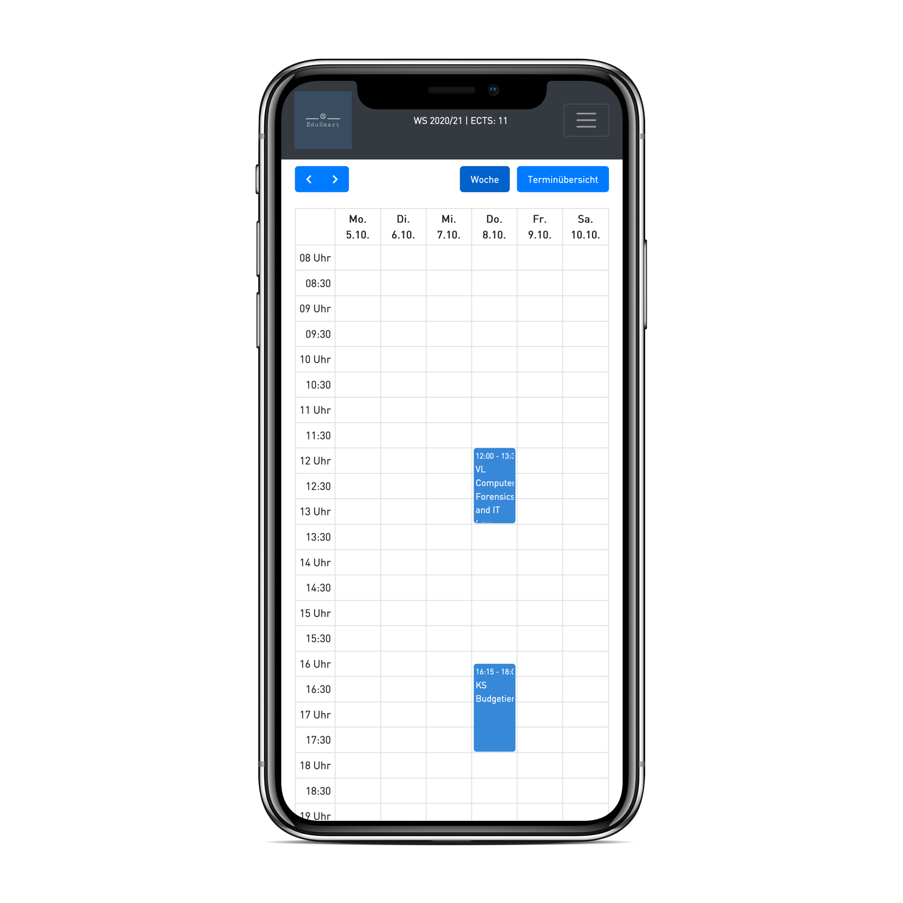

# EduSmart
EduSmart is a tool, which should help students of the JKU to plan their semester more efficiently. Instant overlap detection, general management functions and an embedded calender are the key features of EduSmart. In addition, EduSmart aims to be responsive. However, keep in mind that EduSmart **IS NOT!** a replacement for KUSSS. This tool should be seen more as a supplement for planning purposes.

Visit the website [EduSmart](https://okihub.io) and test yourself :-)

Desktop             |  Mobile
:-------------------------:|:-------------------------:
  |  

### Additional notes
This project is developed and mantained by two students of the JKU and is free of use. However, you can help us by participating in the project or providing constructive feedback. Please note, that EduSmart is a private project for the sake of the JKU students, so the use is of everyone's own risk! Also note, that this project is currently in the beta phase and bugs might appear here and there.
